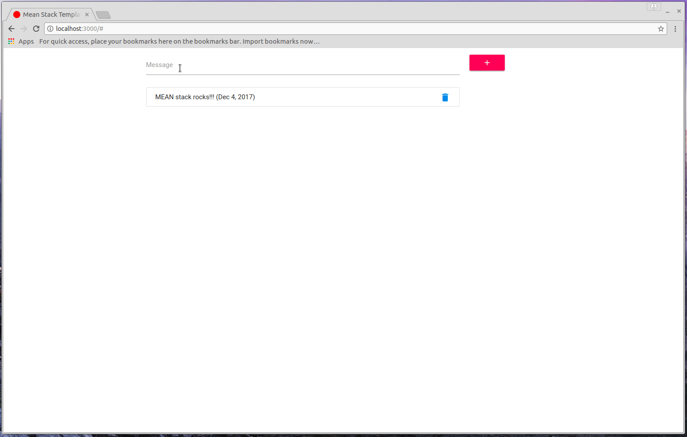

#### Basic MEAN Stack Template

#### Requirements
- [Node.js](https://nodejs.org/)
- [MongoDB](https://www.mongodb.org/)

#### Getting started
- `git clone https://github.com/stojanovic-vukas/MEAN-Stack-Template/tree/master/messageapp.git`
- `cd messageapp`
- `npm install`
- `node index.js`
- Open a browser and go to [http://localhost:3000](http://localhost:3000).
